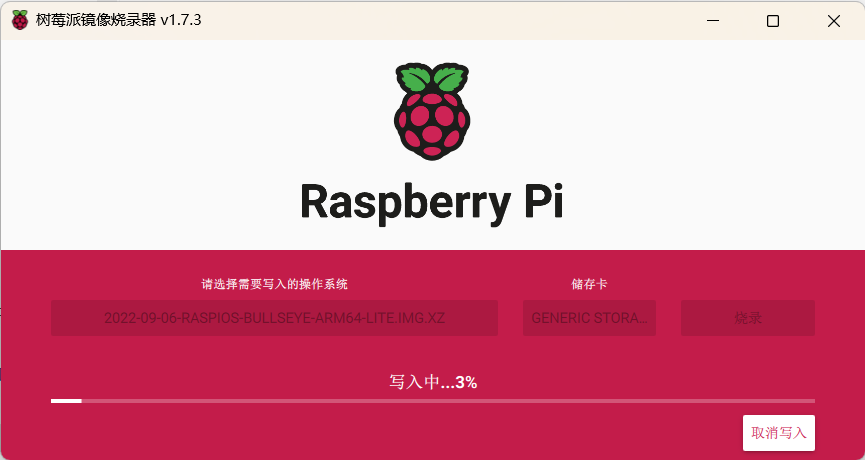
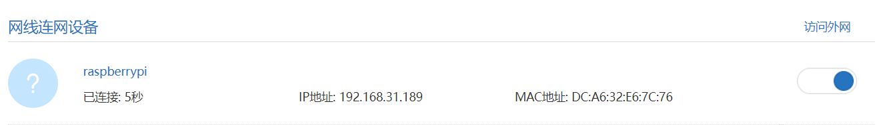
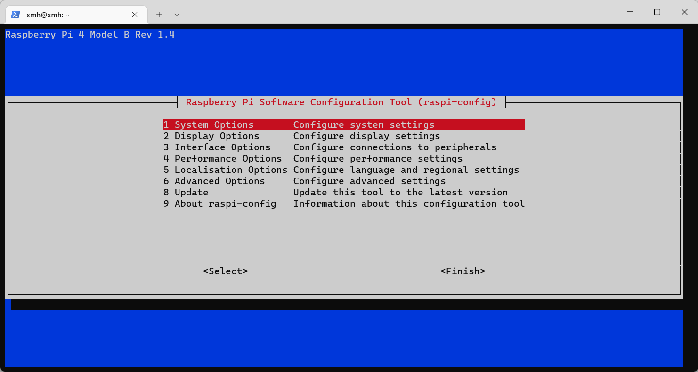
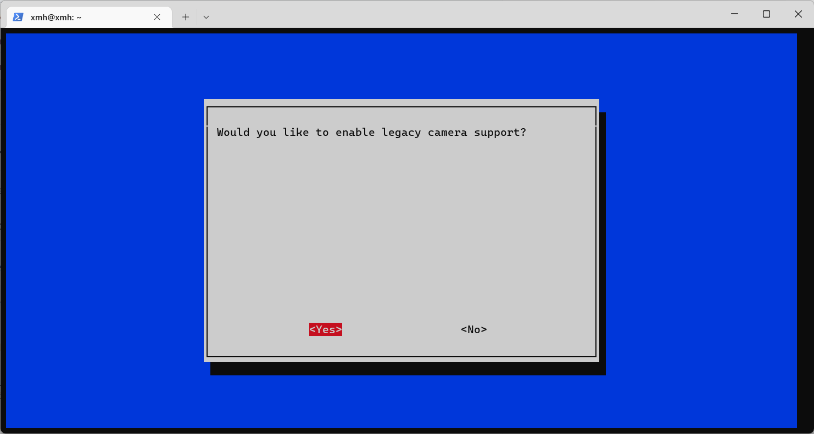

- Download system image
  - [iso](https://www.raspberrypi.com/software/operating-systems/)
- 使用官方镜像烧录器烧录

  - 

  - [download the installer](https://www.raspberrypi.com/software/)
- plug the Ethernet into the Raspberry Pi

- connected，find the ip in the manage system of router
- log-in

```bash
      ssh -l xmh 192.168.31.189
```

- `sudo raspi-config`

- 

-  `Interface Options`

- 

- follow https://github.com/meinside/rpi-mjpg-streamer

- 更换软件源

  ```bash
  uname -m 
  armv7l
  sudo apt-get install build-essential libjpeg8-dev imagemagick libv4l-dev git cmake uvcdynctrl
  ```

- `apt install` 时遇到的问题

```
Package libjpeg8-dev is not available, but is referred to by another package.
This may mean that the package is missing, has been obsoleted, or
is only available from another source
However the following packages replace it:
  libjpeg9-dev libjpeg62-turbo-dev
```

- frp配置
  - Aliyun 服务器
  - 放开服务器`7000`端口和`8080`
  - 将`8080`端口映射至公网

```
配置文件
=====
```

- modify the `run-mjpg-streamer.sh`

- ```bash
  chmod +x run-mjpg-streamer.sh
  sh ./run-mjpg-streamer.sh
  ```

- 更换pip源

- web端已经通过`rpi-mjpg-streamer`实现

- [static-snapshot](http://mc.xwxstudio.com/?action=snapshot)

- 通过`requests`包获取图片

- 为了日后后端代码更好工作，尝试使用`opencv`进行相机控制

- 更新`pip`源，`pip3 install pip -U`
- `sudo apt-get install python3-opencv`
- `sudo apt-get install libopencv-dev`

- `pip3 install numpy --upgrade`

- `sudo apt-get install libatlas-base-dev`

```python
import cv2
import numpy

#init
camera = cv2.VideoCapture(0)

#read the camera
ret,img = camera.read()

#保save to snapshot.jpg
cv2.imwrite('img.jpg',img)
cv2.imwrite('gray.jpg',gray)

#release the camera
camera.release()
cv2.destroyAllWindows()
```

