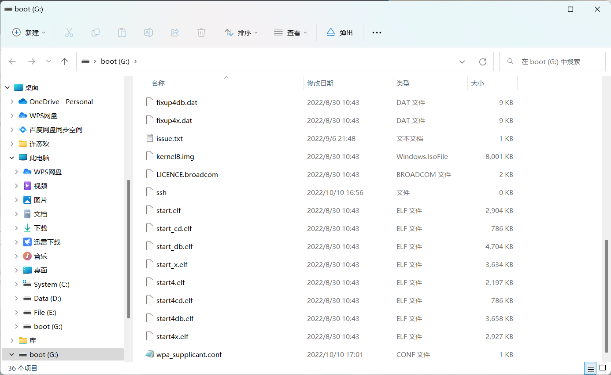

- 背景解释

- `raspberryPi`
  - `armv7l`

- `mjpg-streamer`

- `rpi-mjpg-streamer`

- `frp`


- 下载镜像
  - [iso](https://www.raspberrypi.com/software/operating-systems/)

- 使用官方镜像烧录器烧录

  - 

  - [installer](https://www.raspberrypi.com/software/)

- 树莓派使用LAN口连接路由器

  - 

- 连接上了，在小米路由器中查看本地ip
  - 

- Wi-Fi 不启用

- 登录

```bash
      ssh -l xmh 192.168.31.189
```

- `raspi-config` 打开摄像头，`Interface Options`

- 

- 

- follow https://github.com/meinside/rpi-mjpg-streamer

- 更换软件源

  ```bash
  uname -m 
  armv7l
  sudo apt-get install build-essential libjpeg8-dev imagemagick libv4l-dev git cmake uvcdynctrl
  ```

- `apt install` 时遇到的问题

```
Package libjpeg8-dev is not available, but is referred to by another package.
This may mean that the package is missing, has been obsoleted, or
is only available from another source
However the following packages replace it:
  libjpeg9-dev libjpeg62-turbo-dev
```

- frp配置
  - Aliyun 服务器
  - 放开服务器`7000`端口和`8080`
  - 将`8080`端口映射至公网

```
配置文件
=====
```

- modify the `run-mjpg-streamer.sh`

- ```bash
  chmod +x run-mjpg-streamer.sh
  sh ./run-mjpg-streamer.sh
  ```

- 更换pip源

- web端已经通过`rpi-mjpg-streamer`实现

- [static](http://mc.xwxstudio.com/?action=snapshot)

- 通过`requests`包获取图片

- 为了`opencv`更好工作，尝试使用`picamera`进行相机控制

